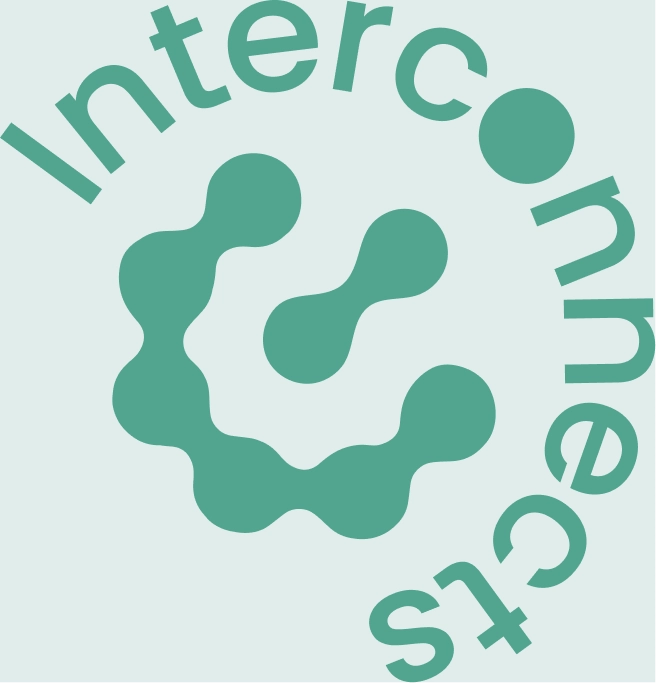

# Rows and Columns

<!-- columns: 3 -->
### Columns

Use `columns: 40/60`

Split with `|||`

|||

### Rows

Use `rows: 60/40`

Split with `===`

|||

### Nesting

Use `row-columns: 40/60`

inside one row block

---

<!-- rows: 35/65 -->
## Rows: top summary, bottom visual

This is the simplest row split:

- short setup on top
- large visual region below

===

<div style="height: 100%; min-height: 260px; border: 2px dashed #c7ced9; border-radius: 18px; display: flex; align-items: center; justify-content: center; text-align: center; color: #7b8496; font-size: 1.3em; padding: 1.5em;">
Bottom row visual
</div>

---

<!-- rows: 45/55 -->
## Nested columns inside a row

<!-- row-columns: 40/60 -->
Use `row-columns` when only one row needs a column split.

The lower image auto-fits its row box.

|||

- right side can hold a denser list
- or a narrow figure caption
- while the lower row stays full width

===



---

<!-- rows: 65/35 -->
## Big top image, small bottom notes


===

<div class="text-sm">

- Good for full-width charts or timelines
- Bottom row can hold takeaway text or citations
- Keeps the image from fighting a side column

</div>

---

<!-- rows: 3 -->
## Three equal rows

Top row can hold a short setup or takeaway.

===

<!-- row-columns: 2 -->
Middle left can expand into a supporting point.

|||

Middle right can hold a parallel point or comparison.

===

Bottom row can close with a summary, citation, or next step.

---

<!-- columns: 48/52 -->
## Code blocks in columns

**Python code:**

```python
messages = [
    {
        "role": "system",
        "content": "You are a friendly chatbot who always responds in the style of a pirate",
    },
    {
        "role": "user",
        "content": "How many helicopters can a human eat in one sitting?",
    },
]
```

|||

**Template text:**

```text
<|im_start|>system
You are a friendly chatbot who always responds in the style of a pirate<|im_end|>
<|im_start|>user
How many helicopters can a human eat in one sitting?<|im_end|>
<|im_start|>assistant
```

`tokenizer.apply_chat_template(messages)` performs this conversion before tokenization.
